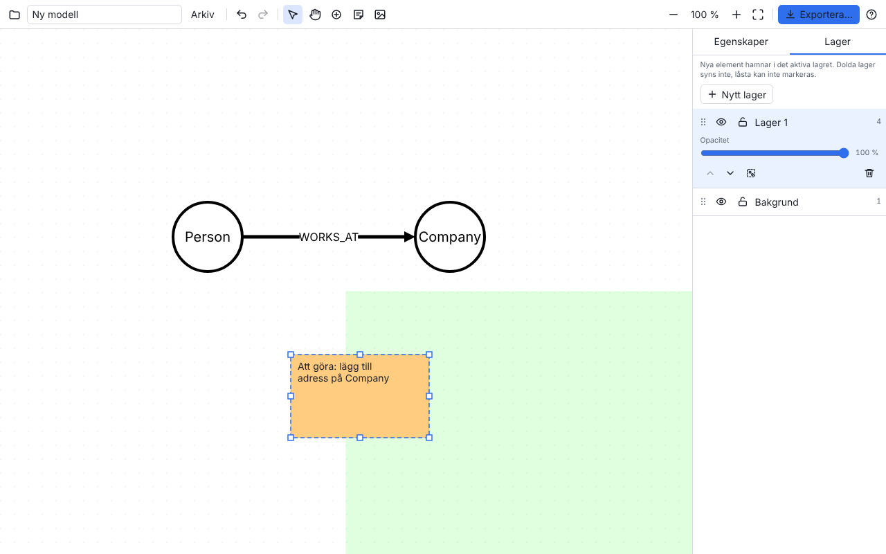

# Graphbuilder

Draw graph models (nodes and relationships) in the browser, in the spirit of arrows.app, with three additions:

- **Layers** – put nodes, relationships, notes and images in layers like in an image editor.
  Show/hide, lock, rename and reorder. New elements go into the active layer.
- **Notes** – free-text sticky notes on the canvas with color, text size and alignment.
- **Background images** – add images (button, drag-and-drop or paste) as a backdrop, scale them
  proportionally, set opacity and lock them.

## Try the app

The app is published at **https://henriklantzhedstrom-prog.github.io/Graphbuilder/** and is
updated automatically with every new version.



## Features

- Create nodes with the **Add node** button in the side panel, drag relationships from a node's ring (drop on empty space to create a node).
- Labels and properties on nodes (each label or label combination can be used by only one node), with a checkbox to choose which property is shown as the caption; type, direction and properties on relationships.
- Style per element or for the whole model: colors, radius, border width, text sizes, dashed lines.
- Drag the background to move the whole canvas. Select by click, Shift+click or Shift+drag (marquee); move by dragging or with the arrow keys; snap guides.
- Undo/redo, duplicate, copy/paste, keyboard shortcuts (press `?` in the app).
- Models are saved automatically in the browser. "My models" manages several models.
- Save/open as a JSON file. Import JSON from arrows.app.
- Export to JSON, Cypher (Neo4j `CREATE` statements), SVG and PNG, optionally visible layers only.
- Light theme by default; a button in the toolbar switches to dark mode.

## Run locally

```
npm install
npm run dev
```

## Quality checks

```
npm run check   # lint, type check, unit tests
npm run e2e     # end-to-end tests in Chromium (builds and serves the app itself)
npm run build   # production build to dist/
```

CI runs the same checks on every push. A push to `main` builds the app and publishes it to the
`gh-pages` branch, which GitHub Pages serves.
